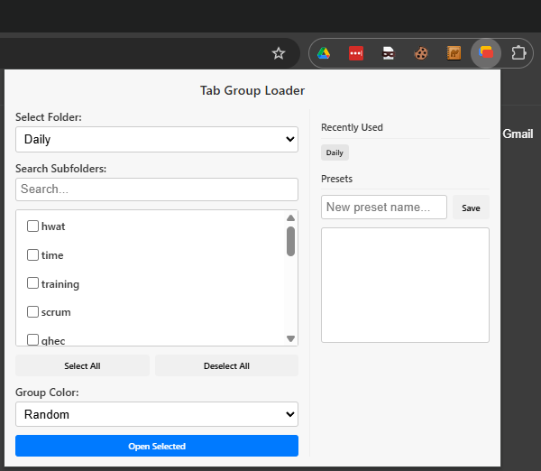

# Tab Group Loader

A Chrome extension to quickly open bookmark folders as organized tab groups. Save and load preset folder selections, and customize group colors.

## Features

-   **Open Multiple Folders:** Select and open multiple bookmark subfolders into organized tab groups simultaneously.
-   **Save & Load Presets:** Save your favorite folder selections as presets for one-click access.
-   **Recently Used:** Quickly access your most recently used parent folders.
-   **Color Customization:** Assign specific colors to your tab groups, or use a random color for each.
-   **Subfolder Search:** Instantly filter the subfolder list to find what you need.
-   **Selection Count Badge:** The extension icon shows a badge with the number of currently selected folders.

## Installation

1.  Open Chrome and navigate to `chrome://extensions`.
2.  Enable "Developer mode" in the top right corner.
3.  Click "Load unpacked".
4.  Select the `tab-group-loader` project directory.

## Usage

1.  **Select a Parent Folder:** Click the extension icon. Use the "Select Folder" dropdown to choose a main folder from your bookmarks bar.
2.  **Choose Subfolders:** The extension will display all the subfolders contained within the selected parent folder. Check the boxes next to the subfolders you want to open.
3.  **Customize Group Color:** Use the "Group Color" dropdown to assign a color to the new tab groups. "Random" will cycle through available colors.
4.  **Open Tab Groups:** Click the "Open Selected" button. The extension will create a new tab group for each selected subfolder, with all its bookmarks opened as tabs inside.
5.  **Save a Preset:** To save a selection for later, enter a name in the "New preset name..." field and click "Save".
6.  **Load a Preset:** Click the "Load" button next to a saved preset to instantly re-select the saved folders.

## How It Works

The extension is built using standard web technologies (JavaScript, HTML, CSS) and leverages several Chrome Extension APIs:

-   The **`bookmarks`** API is used to read the folder structure of your bookmarks bar.
-   The **`storage`** API saves your presets and recently used folders locally on your machine.
-   When you open selected folders, a message is sent to the extension's service worker (`background.js`), which uses the **`tabs`** and **`tabGroups`** APIs to create the new tabs and organize them into colored groups.

Your data is processed locally and is not collected or sent anywhere.
